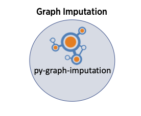

# py-graph-imputation
[](https://pypi.python.org/pypi/py-graph-imputation)

* [Graph Imputation](#graph-imputation)
* [Development](#develop)
* [Running A Minimal Example Imputation](#running-a-minimal-configuration-example)

### Graph Imputation

`py-graph-imputation` is the successor of [GRIMM](https://github.com/nmdp-bioinformatics/grimm) written in Python and based on [NetworkX](https://networkx.org/)



### Use `py-graph-imputation`

#### Install `py-graph-imputation` from PyPi
```
pip install py-graph-imputation
```

#### Get Frequency Data and Subject Data and Configuration File

For an example, get [example-conf-data.zip](https://github.com/nmdp-bioinformatics/py-graph-imputation/tree/master/example-conf-data.zip)

Unzip the folder so it appears as:

```
conf
|-- README.md
`-- minimal-configuration.json
data
|-- freqs
|   `-- CAU.freqs.gz
`-- subjects
    `-- donor.csv
```

#### Modify the configuration.json to suit your need


#### Produce HPF csv file from Frequency Data

```
>>> from graph_generation.generate_hpf import produce_hpf
>>> produce_hpf(conf_file='conf/minimal-configuration.json')
****************************************************************************************************
Conversion to HPF file based on following configuration:
	Population: ['CAU']
	Frequency File Directory: data/freqs
	Output File: output/hpf.csv
****************************************************************************************************
Reading Frequency File:	 data/freqs/CAU.freqs.gz
Writing hpf File:	 output/hpf.csv
```

This will produce the files which will be used for graph generation:

```
output
|-- hpf.csv                         # CSV file of Haplotype, Populatio, Freq
`-- pop_counts_file.txt             # Size of each population
```

#### Generate the Graph (nodes and edges) files

```
>>> from grim.grim import graph_freqs

>>> graph_freqs(conf_file='conf/minimal-configuration.json')
****************************************************************************************************
Performing graph generation based on following configuration:
	Population: ['CAU']
	Freq File: output/hpf.csv
	Freq Trim Threshold: 1e-05
****************************************************************************************************
```

This will produce the following files:

```
output
`-- csv
    |-- edges.csv
    |-- info_node.csv
    |-- nodes.csv
    `-- top_links.csv
```

#### Produce Imputation Results for Subjects

```
>>> from grim.grim import impute
>>> impute(conf_file='conf/minimal-configuration.json')
****************************************************************************************************
Performing imputation based on:
	Population: ['CAU']
	Priority: {'alpha': 0.4999999, 'eta': 0, 'beta': 1e-07, 'gamma': 1e-07, 'delta': 0.4999999}
	UNK priority: SR
	Epsilon: 0.001
	Plan B: True
	Number of Results: 10
	Number of Population Results: 100
	Nodes File: output/csv/nodes.csv
	Top Links File: output/csv/edges.csv
	Input File: data/subjects/donor.csv
	Output UMUG Format: True
	Output UMUG Freq Filename: output/don.umug
	Output UMUG Pops Filename: output/don.umug.pops
	Output Haplotype Format: True
	Output HAP Freq Filename: output/don.pmug
	Output HAP Pops Filename: output/don.pmug.pops
	Output Miss Filename: output/don.miss
	Output Problem Filename: output/don.problem
	Factor Missing Data: 0.0001
	Loci Map: {'A': 1, 'B': 2, 'C': 3, 'DQB1': 4, 'DRB1': 5}
	Plan B Matrix: [[[1, 2, 3, 4, 5]], [[1, 2, 3], [4, 5]], [[1], [2, 3], [4, 5]], [[1, 2, 3], [4], [5]], [[1], [2, 3], [4], [5]], [[1], [2], [3], [4], [5]]]
	Pops Count File: output/pop_counts_file.txt
	Use Pops Count File: output/pop_counts_file.txt
	Number of Options Threshold: 100000
	Max Number of haplotypes in phase: 100
	Save space mode: False
****************************************************************************************************
0 Subject: D1 8400 haplotypes
0 Subject: D1 6028 haplotypes
0.09946062499999186
```

This will produce files in `output` directory as:

```
├── output
│ ├── don.miss                # Cases that failed imputation (e.g. incorrect typing etc.)
│ ├── don.pmug                # Phased imputation as PMUG GL String
│ ├── don.pmug.pops           # Population for Phased Imputation
│ ├── don.problem             # List of errors
│ ├── don.umug                # Unphased imputation as UMUG GL String
│ ├── don.umug.pops           # Population for Phased Imputation
```


### Development
How to develop on the project locally.

1. Make sure the following pre-requites are installed.
   1. `git`
   2. `python >= 3.8`
   3. build tools eg `make`
2. Clone the repository locally
    ```shell
    git clone git@github.com:nmdp-bioinformatics/py-graph-imputation.git
    cd py-graph-imputation
    ```
3. Make a virtual environment and activate it, run `make venv`
   ```shell
    > make venv
      python3 -m venv venv --prompt py-graph-imputation-venv
      =====================================================================
    To activate the new virtual environment, execute the following from your shell
    source venv/bin/activate
   ```
4. Source the virtual environment
   ```shell
   source venv/bin/activate
   ```
5. Development workflow is driven through `Makefile`. Use `make` to list show all targets.
   ```
    > make
    clean                remove all build, test, coverage and Python artifacts
    clean-build          remove build artifacts
    clean-pyc            remove Python file artifacts
    clean-test           remove test and coverage artifacts
    lint                 check style with flake8
    behave               run the behave tests, generate and serve report
    pytest               run tests quickly with the default Python
    test                 run all(BDD and unit) tests
    coverage             check code coverage quickly with the default Python
    dist                 builds source and wheel package
    docker-build         build a docker image for the service
    docker               build a docker image for the service
    install              install the package to the active Python's site-packages
    venv                 creates a Python3 virtualenv environment in venv
    activate             activate a virtual environment. Run `make venv` before activating.
   ```
6. Install all the development dependencies. Will install packages from all `requirements-*.txt` files.
   ```shell
    make install
   ```
7. Package Module files go in the `grim` directory.
    ```
    grim
    |-- __init__.py
    |-- grim.py
    `-- imputation
        |-- __init__.py
        |-- cutils.pyx
        |-- cypher_plan_b.py
        |-- cypher_query.py
        |-- impute.py
        `-- networkx_graph.py
    ```
8. Run all tests with `make test` or different tests with `make behave` or `make pytest`.
9. Run `make lint` to run the linter and black formatter.
10. Use `python app.py` to run the Flask service app in debug mode. Service will be available at http://localhost:8080/
11. Use `make docker-build` to build a docker image using the current `Dockerfile`.
12. `make docker` will build and run the docker image with the service.  Service will be available at http://localhost:8080/


### Running a minimal configuration example

From the main directory of the repo run:
```
scripts/build-imputation-validation.sh
```

This will prepare and load frequency data into the graph and run imputation on a sample set of subjects.

The execution is driven by the configuration file: `conf/minimal-configuration.json`

It takes input from this file:
```
data/subjects/donor.csv
```

And generates an `output` directory with these contents:

```
output
├── don.miss
├── don.pmug
├── don.pmug.pops
├── don.problem
├── don.umug
└── don.umug.pops
```

The `.problem` file contains cases that failed due to serious errors (e.g., invalid HLA).

The `.miss` file contains cases where there was no output possible given the input, frequencies and configuration options.

The `.pmug` file contains the Phased Multi-locus Unambiguous Genotypes.

The `.umug` file contains the Un-phased Multi-locus Unambiguous Genotypes.


The format of both files is (csv):

* id
* genotype - in glstring format
* frequency
* rank


The `.pmug.pops` and `.umug.pops` contain the corresponding population assignments.

The format of the `.pops` files is (csv):

* id
* pop1
* pop2
* frequency
* rank
